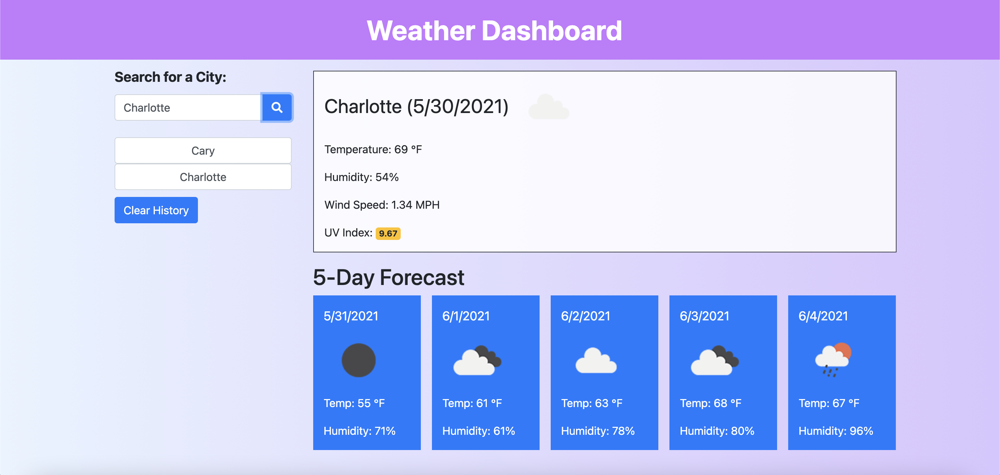

# Weather-Dashboard

## Description

This is a weather application that allows the user to search for a city and displays the current and forecasted weather information. The application uses local storage to save the user's search history and it can be cleared. 

This application uses OpenWeatherAPI, bootstrap, and Axios.

## Link

https://thangnt336.github.io/Weather-Dashboard/

## Usage

